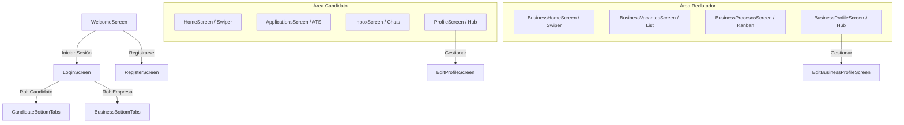
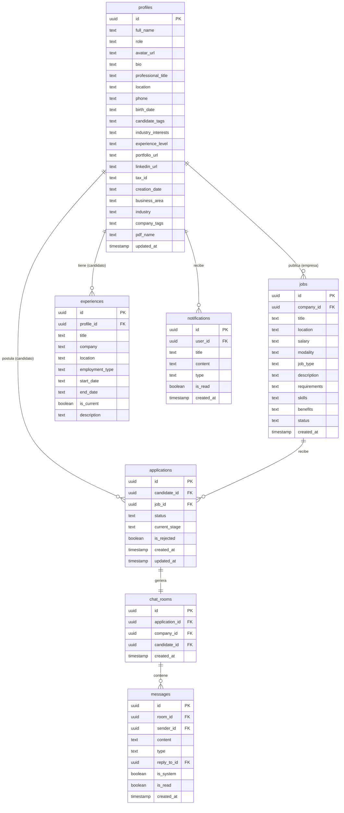

# 📘 Documentación Técnica - Aptly (Obsidian Experience)

Este documento describe detalladamente la arquitectura interna, estructura de datos, tecnologías y flujos lógicos de **Aptly**. Está diseñado para que cualquier desarrollador o miembro externo al equipo pueda comprender con total claridad cómo está construida la aplicación y cómo interactúan sus diferentes módulos.

---

## 🛠️ 1. Tecnologías y Herramientas Empleadas

Aptly está construida sobre una arquitectura moderna de desarrollo móvil híbrido y Backend-as-a-Service (BaaS):

*   **Entorno de Desarrollo Principal:** `React Native (Expo v54)` con `TypeScript` para un tipado estricto y un entorno multiplataforma eficiente.
*   **Motor de Base de Datos y Backend (BaaS):** `Supabase` (PostgreSQL) para la persistencia, almacenamiento relacional e integraciones seguras.
*   **Gestión de Sesiones y Seguridad:** `Supabase Auth` (con soporte para OAuth de Google y GitHub) y políticas de seguridad a nivel de fila (`RLS - Row Level Security`) en Postgres.
*   **Comunicación en Tiempo Real:** `Supabase Realtime` (canales de replicación PostgreSQL) para chats, notificaciones instantáneas y actualización del pipeline ATS.
*   **Almacenamiento de Archivos (Storage):** `Supabase Storage` (Buckets privados y públicos para CVs en PDF, logos corporativos e imágenes en chats).
*   **Diseño Visual y Estilizado:** `Tailwind CSS (NativeWind)` junto con `React Native Stylesheet` para componer una estética oscura fluida (*Obsidian Experience*), efectos glassmórficos y neones.
*   **Componentes Nativos Adicionales:**
    *   `expo-blur` para los efectos de desenfoque de fondo y barras de navegación translúcidas.
    *   `expo-document-picker` e `expo-image-picker` para la selección interactiva de PDFs y fotos.
    *   `react-native-reanimated` para micro-animaciones en las tarjetas de swipes.

---

## 🏗️ 2. Arquitectura de Software y Estructura de Carpetas

Aptly utiliza una arquitectura estructurada por pantallas (screens) y componentes reutilizables (component-driven architecture). La navegación está centralizada mediante una pila de navegación nativa combinada con navegación por pestañas inferiores (Bottom Tabs).

### 📂 Estructura del Workspace

```text
Aptly/
├── .expo/                  # Configuraciones de compilación de Expo
├── assets/                 # Recursos estáticos (fuentes, iconos, imágenes)
├── components/             # Componentes UI globales reutilizables (ObsidianHeader, loaders)
├── lib/                    # Inicializadores de librerías externas
│   └── supabase.ts         # Cliente Supabase inicializado con tokens
├── navigation/             # Enrutador y stacks de navegación (BottomTabs, AppNavigator)
├── QuickShare_2605251528/  # Capturas de pantalla reales (Manual de Usuario)
├── scratch/                # Scripts auxiliares y resultados de pruebas OCR
├── screens/                # Módulos y pantallas funcionales de la aplicación
│   ├── auth/               # Inicio de sesión, restablecimiento y Onboarding interactivo
│   ├── applications/       # Mis postulaciones y línea de tiempo ATS (candidato)
│   ├── chat/               # Bandeja de entrada y salas de chat (candidato)
│   ├── profiles/           # Perfil Profesional del candidato y sus formularios de edición
│   └── business/           # Consola de Empresa, creador de ofertas, swipes de reclutador,
│       └── processes/      # Kanban ATS editable, perfiles de candidatos y edición corporativa
├── supabase_migration.sql  # Parches y triggers de estructura de datos PostgreSQL
└── supabase_seed_data.sql  # Inyección de datos de prueba realistas para depuración
```

### 🧭 Flujo de Navegación (Router Core)



---

## 🗄️ 3. Diagrama y Estructura de Base de Datos

La base de datos PostgreSQL de Supabase gestiona las relaciones entre perfiles, ofertas de empleo, postulaciones y chats con estrictas políticas de seguridad relacional (Foreign Keys con cascada y triggers automáticos).

### 📐 Modelo Entidad-Relación (MER)



### ⚡ Replicación de Autenticación y Triggers de Onboarding
Para evitar inconsistencias, la replicación de usuarios entre `auth.users` (gestionado internamente por Supabase) y `public.profiles` se realiza mediante una función disparadora (`Trigger`) en Postgres:

1.  **Función:** `public.handle_new_user()`
2.  **Acción:** Al completarse un registro exitoso mediante Supabase Auth, se interceptan los metadatos dinámicos definidos en el onboarding (`role`, `full_name`, `birth_date`, `location`, `nit`, etc.) e inmediatamente se inserta una fila con el mismo `UUID` en la tabla pública de perfiles, resolviendo conflictos de concurrencia mediante `ON CONFLICT (id) DO UPDATE`.

---

## 📺 4. Descripción de los Módulos Principales

### Onboarding de Registro Inteligente
*   **Módulo Candidato (`screens/auth/register/RegisterScreen.tsx`):**
    *   Flujo secuencial de 11 pasos que abarca: Seguridad -> Datos -> Edad -> Perfil Profesional.
    *   **Evaluador Vocacional IA:** Invoca 3 preguntas técnicas y conductuales. Al procesar las respuestas del candidato, genera un reporte cognitivo y califica el nivel del perfil asignando un puntaje (ej. *Junior Acreditado IA - 62%*).
    *   **Sectores e Intereses:** Onboarding intuitivo para delimitar las industrias (Tecnología, Construcción, Comercio) en las que el usuario busca empleo.
*   **Módulo Empresa (`screens/auth/register/RegisterScreen.tsx` - Rama Empresa):**
    *   Flujo enfocado en marcas corporativas que recolecta NIT/ID fiscal, área operativa (Industrial, Servicio, Comercial) y sector principal del negocio.

### Experiencia del Candidato (Swipe and Discover)
*   **Swipe Deck (`screens/HomeScreen.tsx`):** Módulo de emparejamiento interactivo. Calcula la afinidad técnica y salarial en tiempo real. Al deslizar un candidato a la derecha (`APTO`), se crea un registro de postulación.
*   **Advanced Filters (`screens/HomeScreen.tsx` - Modal):** Búsqueda granular por modalidad, cargo, ubicación geográfica y filtrado dinámico por etiquetas del stack (ej. *Node.js*).
*   **ATS Pipeline Tracker (`screens/applications/ApplicationStatusScreen.tsx`):** Muestra al candidato el progreso real de su postulación mediante una línea de tiempo (Kanban sincronizado). Si la empresa lo requiere, se despliega una interfaz de carga directa para subir la hoja de vida en PDF a Supabase Storage.

### Consola ATS Empresarial (Recruiter Panel)
*   **Recruiter Swipe Deck (`screens/business/BusinessHomeScreen.tsx`):** Permite al reclutador evaluar candidatos postulados con un **Match Score** predictivo calculado con Inteligencia Artificial.
*   **ATS Kanban Board (`screens/business/processes/CandidatePipelineScreen.tsx`):** Muestra las columnas del flujo (Revisión, Entrevista, Selección, Solicitar Doc.). Los candidatos se mueven entre etapas con actualizaciones optimistas en la UI (interfaz instantánea). Permite añadir etapas personalizadas aplicables a un proceso o globales a toda la empresa, además de escribir notas privadas del candidato en una **Bitácora de Evaluación**.

### Mensajería Instantánea Enriquecida
*   **Bandejas de Entrada (`screens/chat/InboxScreen.tsx` y `screens/business/BusinessInboxScreen.tsx`):** Listan las salas de conversación ordenadas por mensajes no leídos y marcas de tiempo, asistido por barras de búsqueda rápida de nombres.
*   **Chat Rooms (`screens/chat/ChatDetailScreen.tsx` y `screens/business/BusinessChatDetailScreen.tsx`):**
    *   Mensajes en tiempo real con Supabase Realtime (canales bidireccionales).
    *   **Reply (Citar Mensaje):** Permite deslizar cualquier mensaje a la derecha (gesto swipe-to-reply) para referenciarlo y responder sobre él.
    *   **Menú Contextual:** Al mantener presionado un mensaje se despliega una tarjeta glassmórfica para copiar el texto, responder o eliminarlo para todos.
    *   **Adjuntos:** Integración con la galería del teléfono para enviar imágenes codificadas y persistidas en buckets de Supabase.

---

## 🔔 5. Sistema de Alertas Realtime (Notificaciones 🔔)

El flujo de notificaciones en tiempo real mantiene la aplicación viva sin necesidad de consultas repetitivas (polling):

1.  **Eventos Desencadenantes:**
    *   La empresa otorga un Match o cambia la fase del candidato en el Kanban ATS.
    *   Un usuario envía un mensaje nuevo en una sala de chat activa.
2.  **Flujo Relacional:**
    *   El backend inserta un registro en la tabla `public.notifications` con el destinatario, título, cuerpo y tipo de alerta.
    *   El componente global `ObsidianHeader` tiene suscrito un canal en tiempo real en Supabase (`notifications:user_id=eq.MY_ID`).
3.  **Interfaz Visual:**
    *   Al recibir el payload de inserción, la interfaz se refresca de inmediato incrementando un **badge de alerta de color rosa neón** (ej. **`26`**) visible en la cabecera.
    *   Al presionar la campanita, se abre una ventana inmersiva glassmórfica donde se listan las alertas y se permite marcarlas como leídas con un solo clic.

---

## 🚀 6. Guía de Ejecución y Despliegue Local

Para correr Aptly en un entorno de desarrollo local, sigue estos pasos:

### 1. Requisitos Previos
*   Tener instalado `Node.js (v18 o superior)`.
*   Tener instalado `Git`.
*   Un emulador de Android/iOS (ej. Android Studio) o instalar la aplicación **Expo Go** en tu dispositivo móvil físico.

### 2. Clonar e Instalar Dependencias
Clona el repositorio en tu máquina y ejecuta la instalación de paquetes de Node:
```bash
# Navegar al directorio raíz del proyecto
cd c:\Trabajos\Aptly

# Instalar dependencias mediante NPM o PNPM
npm install
```

### 3. Configurar Variables de Entorno
Crea o revisa las claves de conexión a Supabase. Asegura que las credenciales de inicialización del cliente en `lib/supabase.ts` apunten a tu proyecto activo de Supabase:
```typescript
const supabaseUrl = 'https://fohcutrrhrihvzrvynxz.supabase.co';
const supabaseAnonKey = 'TU_SUPABASE_ANON_KEY';
```

### 4. Lanzar el Servidor de Desarrollo de Expo
Inicia el empaquetador metro de React Native Expo:
```bash
npm run start
```
*   **Android:** Presiona `a` en la terminal para abrir la aplicación en tu emulador de Android Studio.
*   **iOS:** Presiona `i` para abrirlo en el simulador de Xcode.
*   **Móvil Físico:** Escanea el código QR desplegado en la terminal utilizando la cámara de tu móvil (iOS) o la app Expo Go (Android).
