# 📖 Manual de Usuario Oficial - Aptly (Obsidian Experience)

¡Bienvenido al **Manual de Usuario de Aptly**! Aptly es una plataforma móvil premium para la búsqueda de empleo y gestión de talento construida con **React Native Expo y Supabase**. Con una interfaz oscura elegante inspirada en la estética **Obsidian**, Aptly une a candidatos y empresas de forma inteligente mediante algoritmos de matching, evaluaciones técnicas asistidas por Inteligencia Artificial y un sistema de seguimiento de candidatos (ATS) en tiempo real con mensajería premium interactiva.

Este manual detalla paso a paso el funcionamiento completo de Aptly, ilustrado con las **64 pantallas reales** de la aplicación, organizadas rigurosamente según sus flujos lógicos reales y orden de interacción.

---

## 🛠️ Índice General

1. [Registro y Onboarding del Candidato (Paso a Paso con IA)](#-1-registro-y-onboarding-del-candidato-paso-a-paso-con-ia)
   - 1.1. Bienvenida e Inicio de Sesión
   - 1.2. Registro, Seguridad y Ubicación
   - 1.3. Evaluación de Competencias Asistida por IA (Chat Cognitivo)
   - 1.4. **Configuración de Sectores de Interés, Habilidades y Contacto**
   - 1.5. Vista Previa del Perfil y Generación de Bio por IA
2. [Registro y Onboarding de la Empresa (Paso a Paso)](#-2-registro-y-onboarding-de-la-empresa-paso-a-paso)
   - 2.1. Cuenta Empresarial y Ubicación Básica
   - 2.2. NIT, Fundación y **Área/Sectores Corporativos**
   - 2.3. Definición de Etiquetas, Cultura y Vista Previa Corporativa
3. [Experiencia y Herramientas del Candidato](#-3-experiencia-y-herramientas-del-candidato)
   - 3.1. Match Finder (Deck de Swipes para Candidatos)
   - 3.2. Filtros Avanzados (Cargo, Modalidad y Habilidades)
   - 3.3. Bandeja "Postulaciones" e Historial
   - 3.4. Detalle de Postulación y Seguimiento del Pipeline ATS (Carga de CV PDF)
   - 3.5. Hub del Perfil Profesional (Professional Hub)
   - 3.6. Gestión y Edición del Perfil (*Edición de Sectores del Candidato*)
4. [Consola ATS de Gestión de la Empresa](#-4-consola-ats-de-gestión-de-la-empresa)
   - 4.1. Management Console (Bandeja de Ofertas y Aplicaciones)
   - 4.2. Publicar Nueva Oferta de Empleo
   - 4.3. Swipe Recruiter Match Finder (Evaluación de Talentos con Match Score)
   - 4.4. Detalles de la Oferta y Candidatos Aplicados
   - 4.5. Panel Kanban de Procesos y Candidatos en Fases ATS
   - 4.6. Guía de Contratación y Bitácora de Evaluación Individual
   - 4.7. Visualización del Perfil de Candidato desde la Empresa
   - 4.8. Hub Corporativo del Perfil Empresarial (Corporate Center)
   - 4.9. Gestión y Edición del Perfil de Empresa (*Edición de Sectores y NIT*)
5. [Suite de Mensajería Global y Chat Enriquecido](#-5-suite-de-mensajería-global-y-chat-enriquecido)
   - 5.1. Bandejas de Entrada de Mensajería (Candidato y Empresa)
   - 5.2. Chat en Tiempo Real y Soporte de Adjuntos
6. [Sistema de Alertas Realtime (Badge Campanita 🔔)](#-6-sistema-de-alertas-realtime-badge-campanita-)

---

## 🔑 1. Registro y Onboarding del Candidato (Paso a Paso con IA)

El registro en Aptly no es un formulario aburrido tradicional. Proporciona una experiencia interactiva guiada por Inteligencia Artificial que evalúa tus capacidades y las complementa estructurando tu currículum de forma inteligente.

### 1.1. Bienvenida e Inicio de Sesión
Al abrir la aplicación, te recibirá una pantalla con estética **Obsidian** (fondo oscuro profundo, tipografías nítidas, contrastes en rosa y azul neón, y botones curvos). Puedes acceder como **Candidato** o **Empresa** e iniciar sesión rápidamente o registrarte utilizando tu correo o redes sociales (Google y GitHub).

  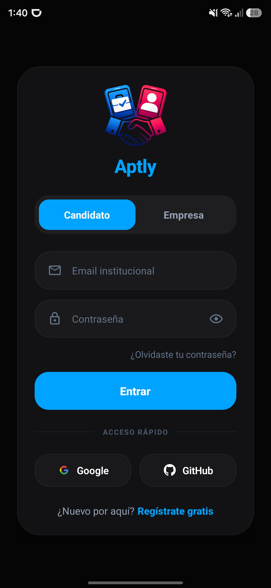
  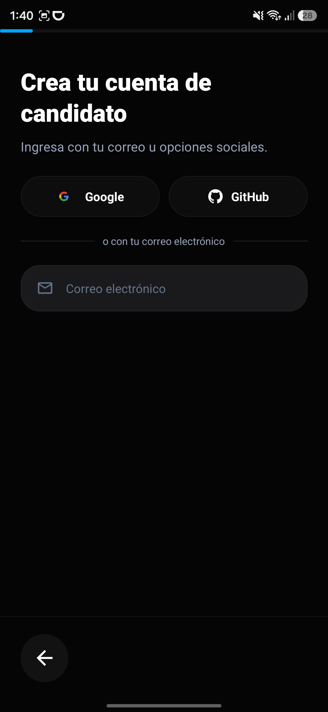

---

### 1.2. Registro, Seguridad y Ubicación
Para garantizar la integridad, el sistema guía al candidato a través de pasos seguros:
1. **Seguridad de la cuenta:** Creación de una contraseña fuerte.
2. **Datos de Identificación:** Ingreso del Nombre Completo, País (ej. Argentina), Ciudad (ej. Acassuso) y Documento Nacional de Identidad (DNI) para la validación legal.
3. **Fecha de Nacimiento:** Selección rápida del año, mes y día de nacimiento a través de un elegante componente de deslizadores horizontales que calcula tu edad dinámica.
4. **Perfil Profesional:** Selección de tu cargo principal (ej. *Frontend Developer*). En esta pantalla, la app te propone realizar una **Certificación de Competencias con IA**.

  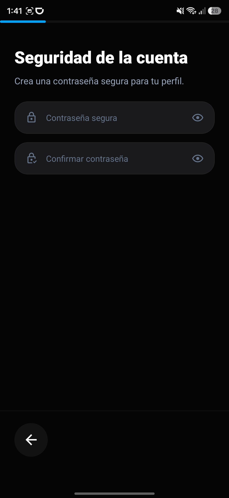
  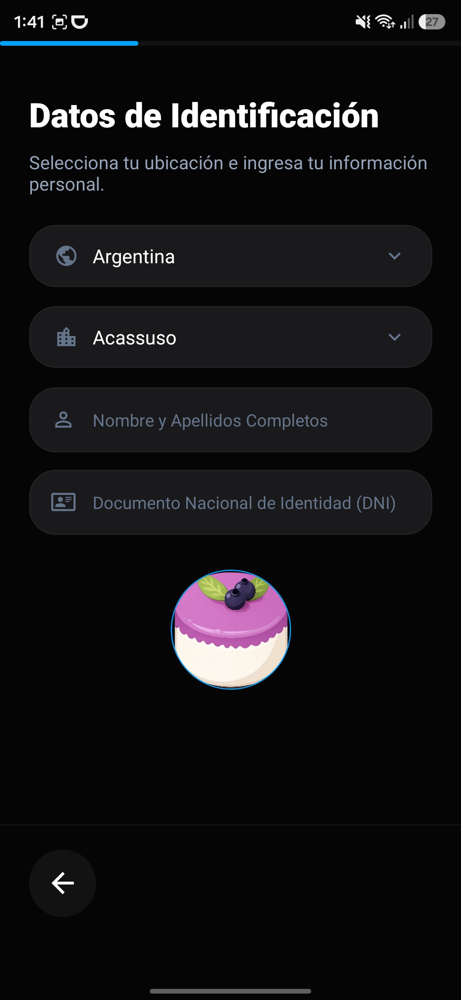
  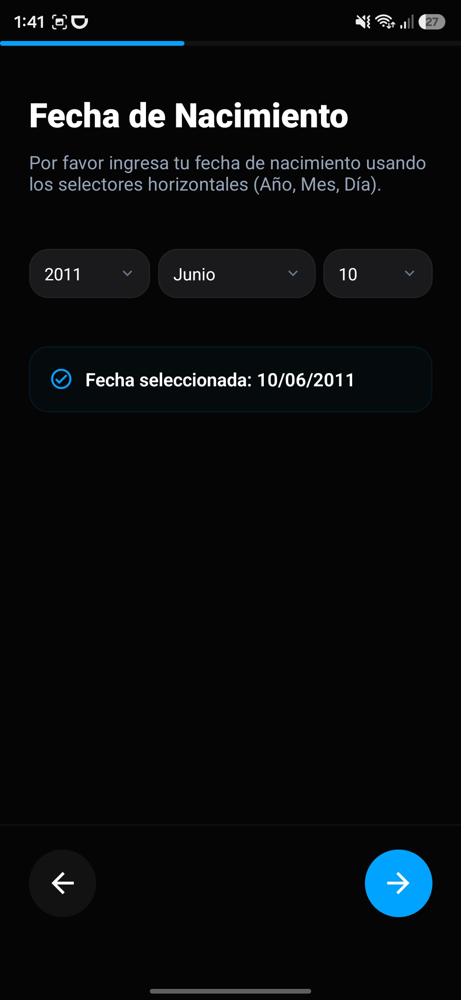
  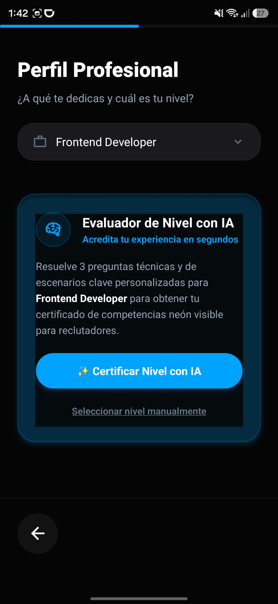

---

### 1.3. Evaluación de Competencias Asistida por IA (Chat Cognitivo)
Si decides certificar tu nivel con IA, entrarás a un flujo inmersivo en el cual el **Evaluador de IA de Aptly** generará una serie de 3 preguntas de desarrollo específicas para el rol seleccionado (ej. *Frontend Developer*):
- **Pregunta 1 de 3:** Describe un desafío técnico y profesional complejo que hayas resuelto, detallando el análisis, tus acciones e impactos.
- **Pregunta 2 de 3:** Describe tu estrategia para priorizar tareas críticas bajo presión extrema.
- **Pregunta 3 de 3:** Valoración personal de tu liderazgo de proyectos y comunicación asertiva (Escala de 1 a 5).

  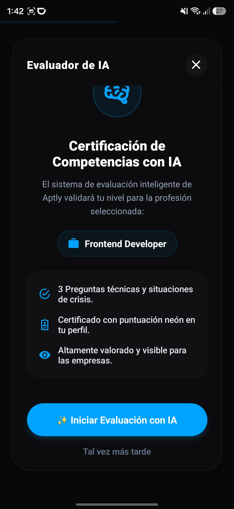
  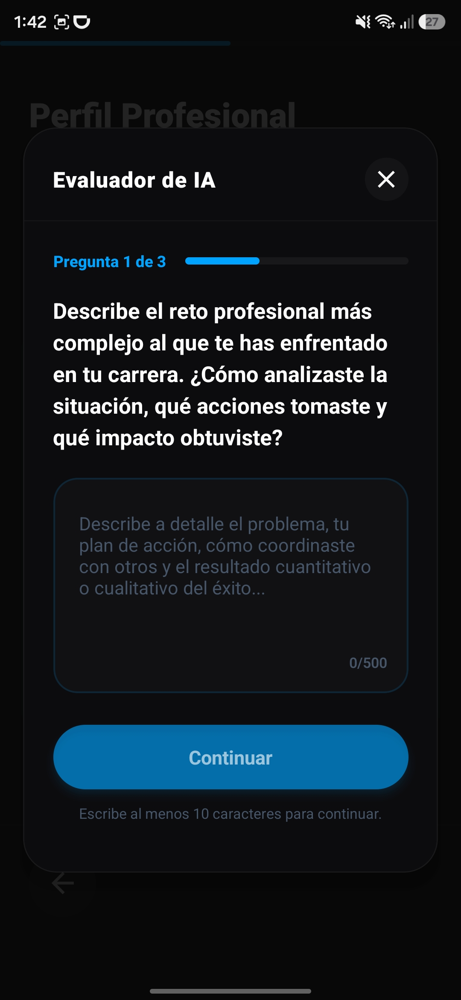
  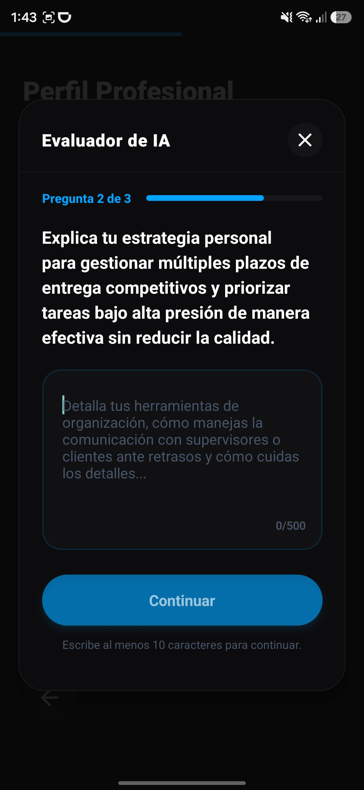

Una vez completadas, Aptly procesa tus respuestas en tiempo real mediante modelos de Procesamiento de Lenguaje Natural (PLN) para evaluar tu vocabulario técnico y respuestas situacionales. Al finalizar, genera un **Rango de Acreditación IA** y un **Reporte Cognitivo** que se expone en tu perfil.

  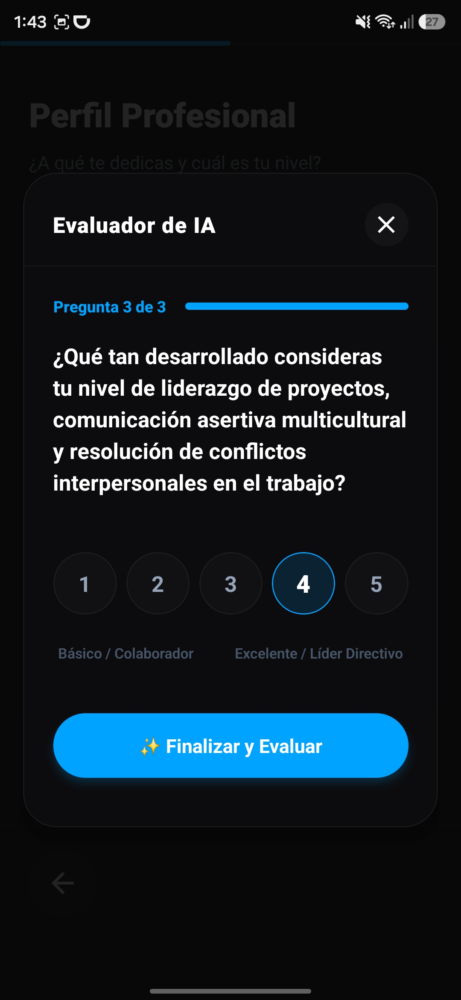
  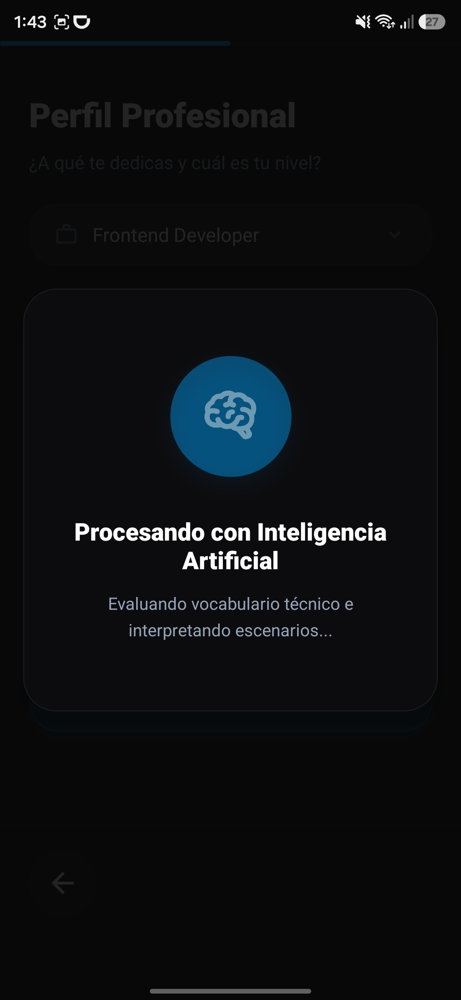
  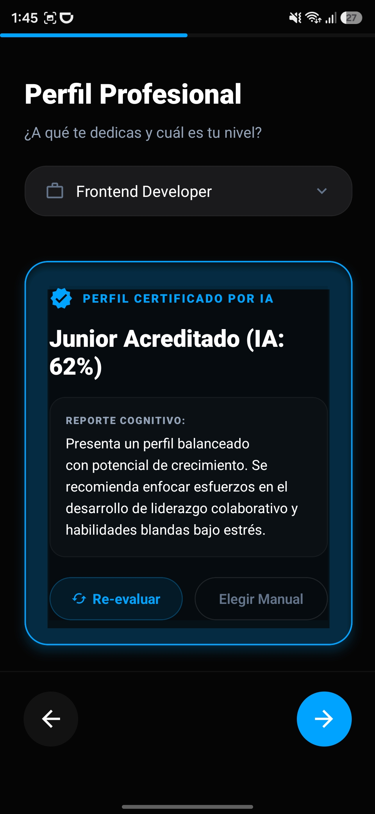

> [!TIP]
> Durante la evaluación, la interfaz se adapta inteligentemente al teclado en pantalla de Android para evitar que los inputs queden bloqueados o colapsados.

---

### 1.4. Configuración de Sectores de Interés, Habilidades y Contacto
El Onboarding continúa recolectando datos claves para el algoritmo de emparejamiento inteligente de Aptly:
1. **¿Qué sectores te interesan?:** (***Sectores del Candidato***) Selector múltiple de sectores industriales en los que desearías laborar (ej. *Ingeniería de Sistemas, Tecnología, Construcción, Finanzas, etc.*). Los sectores se sincronizan con las vacantes empresariales.
2. **Tus Habilidades y Aptitudes:** Selector rápido de etiquetas para habilidades blandas (ej. *Trabajo en Equipo, Liderazgo, Puntualidad, Empatía*) y habilidades técnicas (ej. *Programación, Diseño UI/UX*), además de permitir añadir tags personalizados.
3. **Enlaces y Contacto:** Número celular obligatorio de contacto, enlaces a LinkedIn y a tu portafolio personal.

  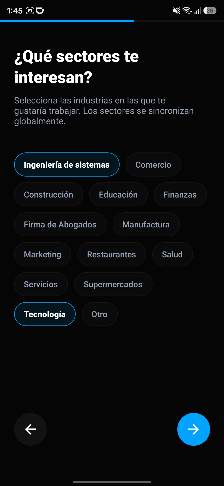
  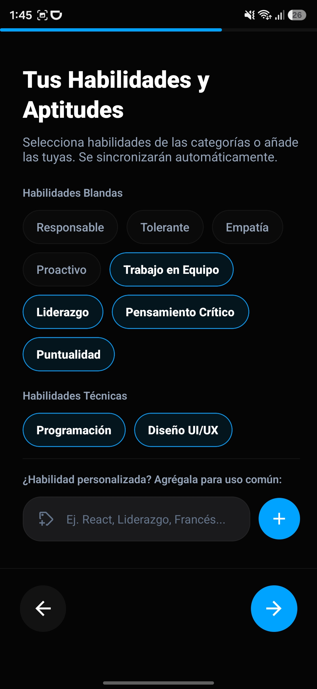
  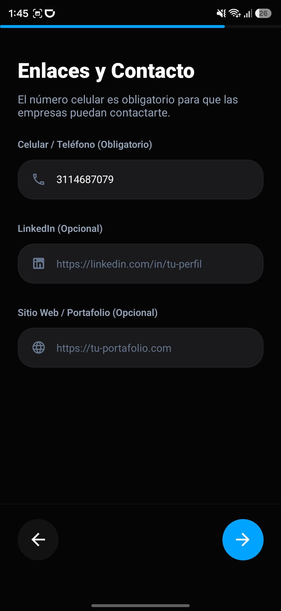

---

### 1.5. Vista Previa del Perfil y Generación de Bio por IA
Para finalizar el Onboarding, el sistema te muestra la **Vista Previa de tu Perfil** tal cual lo verán los reclutadores corporativos. 
Aptly combina tu información básica, tus sectores, tus habilidades y la calificación del test cognitivo de IA para redactar una **Biografía Profesional IA** automática y resumida, lista para capturar el interés del mercado.

  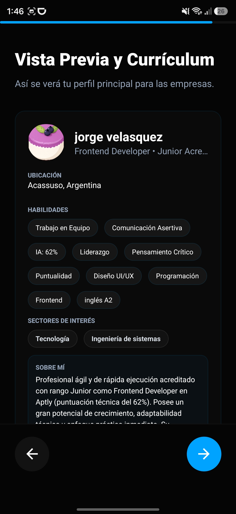

---

## 🏢 2. Registro y Onboarding de la Empresa (Paso a Paso)

El flujo para empleadores y reclutadores está altamente automatizado para que las empresas publiquen sus necesidades y construyan su marca corporativa dentro de la red Obsidian de Aptly.

### 2.1. Cuenta Empresarial y Ubicación Básica
1. **Crea tu cuenta empresarial:** Registro de un correo corporativo e institucional con una contraseña segura.
2. **¡Hagamos crecer tu equipo!:** Ingreso de los datos principales: Nombre o Razón Social, carga de logo, sitio web corporativo, selección de País, Ciudad de la sede y número de teléfono.

  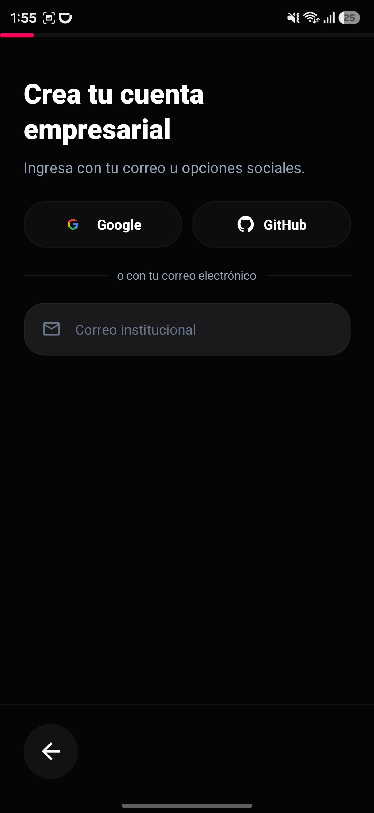
  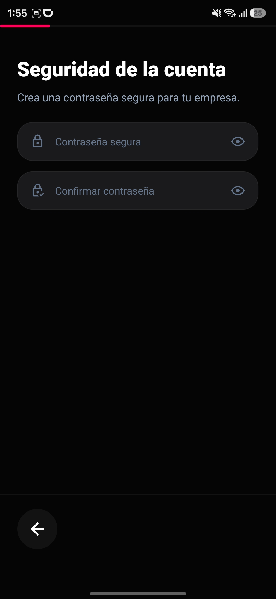
  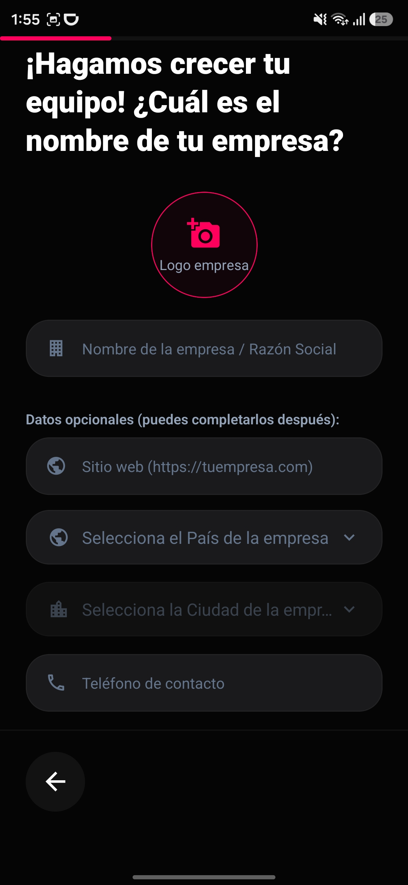

---

### 2.2. NIT, Fundación y Área/Sectores Corporativos
Para validar la legalidad de la empresa y conectar con las industrias correctas:
1. **Identidad corporativa:** Ingreso del NIT o Identificación Fiscal y selección horizontal de la fecha de fundación.
2. **¿En qué área opera la empresa?:** (***Área Operativa***) Clasificación entre *Industrial*, *Servicio* o *Comercial*.
3. **¿Qué sector destaca más?:** (***Sectores de Empresa***) Selector del sector principal en el cual opera la corporación (ej. *Tecnología, Construcción, Comercio, Finanzas, Educación, etc.*). Estos sectores conectan de forma inteligente con el algoritmo de sugerencia de candidatos.

  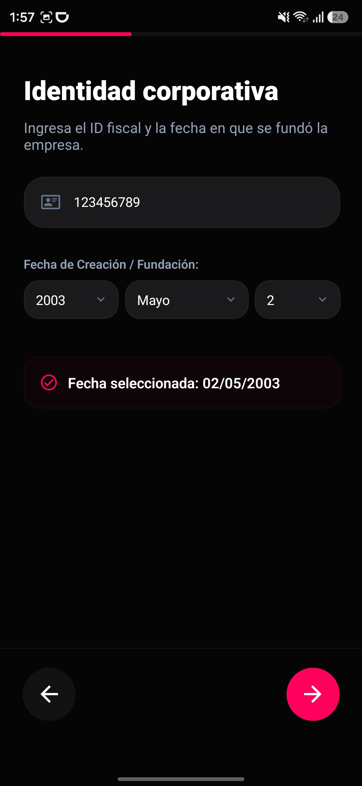
  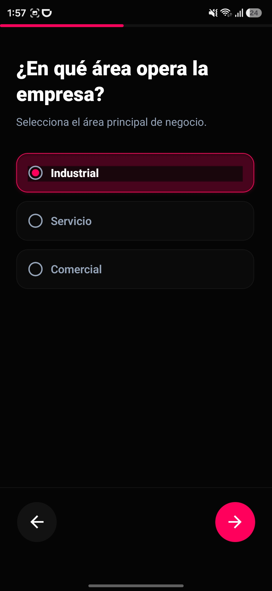
  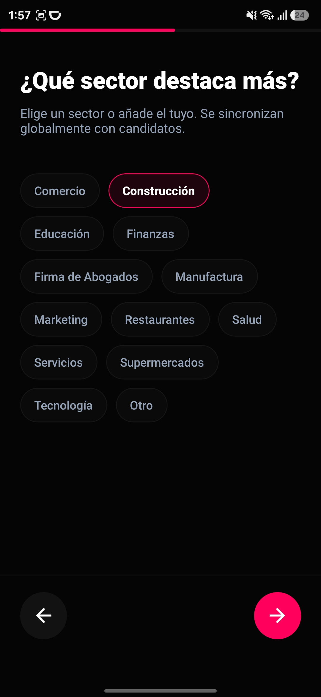

---

### 2.3. Definición de Etiquetas, Cultura y Vista Previa Corporativa
Aptly recopila la identidad corporativa para hacerla atractiva a los talentos:
1. **Etiquetas de la Empresa:** Selección múltiple de características claves:
   - **Modalidad:** *Remoto, Híbrido, Presencial*.
   - **Horarios:** *Tiempo Completo, Medio Tiempo, Fines de Semana, Horario Flexible*.
   - **Beneficios:** *Seguro Médico, Bonos, Crecimiento, Snacks, Gimnasio, Diversidad*.
   - **Tamaño:** *Startup, Pequeña (1-50), Mediana (51-200), Corporativo (200+)*.
2. **Cultura y Valores:** Breve biografía atractiva sobre la misión y valores que definen el ambiente interno.
3. **Vista Previa del Perfil Corporativo:** Permite verificar la tarjeta que verán los candidatos y adjuntar un PDF de Presentación o Portafolio Institucional (ej. *Estrategia_TI.pdf*).

  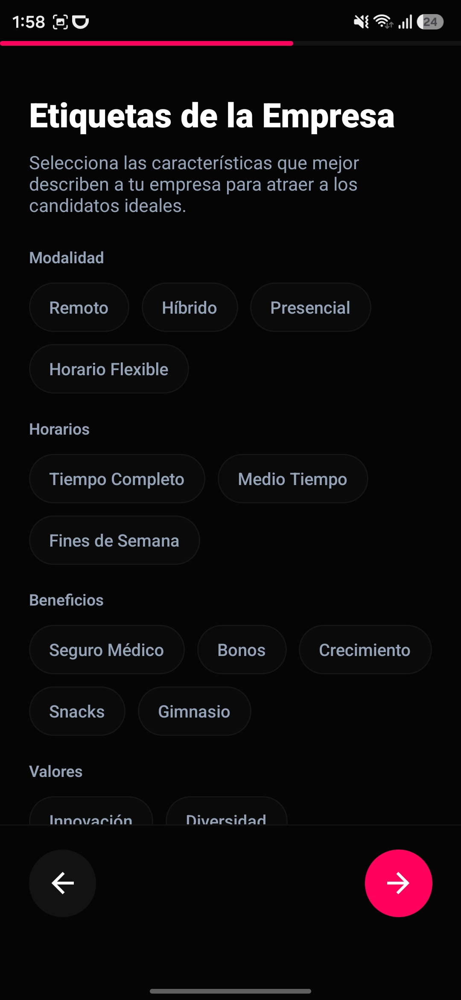
  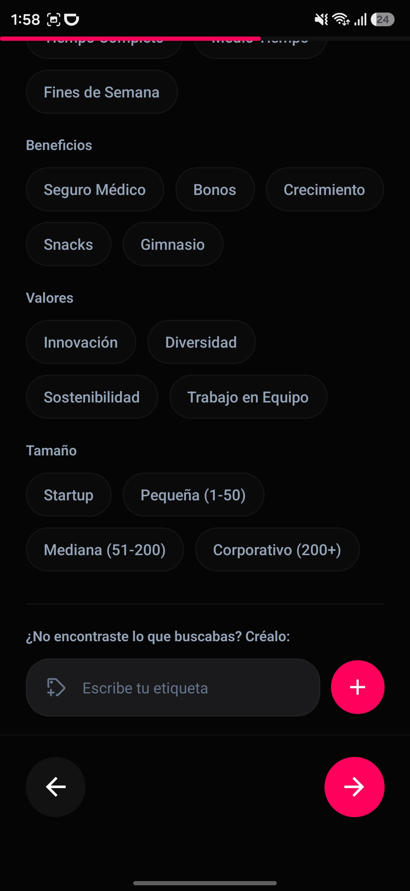
  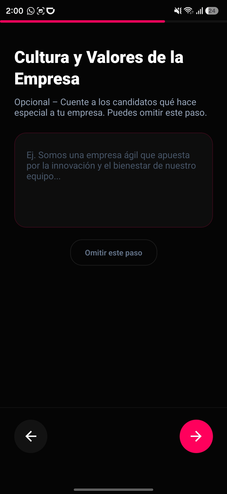
  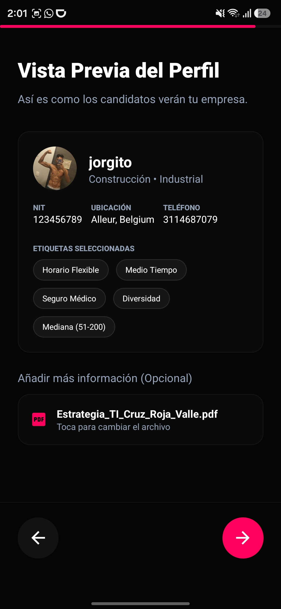

---

## 🔍 3. Experiencia y Herramientas del Candidato

Una vez registrado en Aptly, el candidato entra a un ecosistema enfocado en la usabilidad y la retroalimentación instantánea de los procesos activos.

### 3.1. Match Finder (Deck de Swipes para Candidatos)
La pantalla principal es la interfaz de deslices inteligentes. Cada tarjeta te muestra la vacante, su modalidad, sueldo e insignias.
- **Deslizar a la derecha / Botón azul (APTO):** Te postulas formalmente a la vacante.
- **Deslizar a la izquierda / Botón rojo (NO APTO):** Descartas la oferta. El sistema la oculta permanentemente y no volverá a aparecer.
- **Deslizar hacia arriba / Estrella amarilla (Superlike):** Te postulas con prioridad notificando de forma directa a la bandeja del reclutador.

  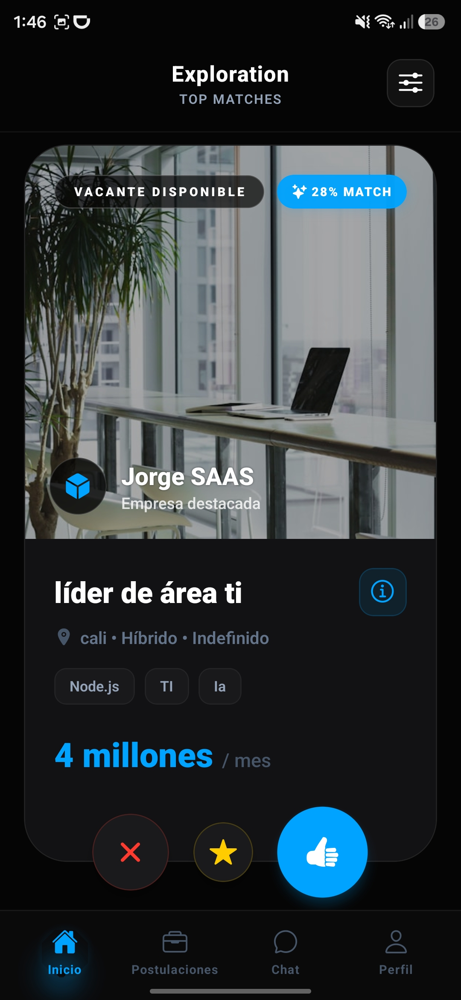

---

### 3.2. Filtros Avanzados (Cargo, Modalidad y Habilidades)
Al presionar el botón de filtro del menú superior, se despliega una bandeja glassmórfica con opciones de búsqueda robustas:
- Filtrado por modalidad (Remoto, Presencial o Híbrido).
- Filtrado por tipo de empleo (Tiempo completo o Medio tiempo).
- Búsqueda directa por Cargo, País, Ciudad o por etiquetas de habilidades específicas (ej. *Node.js*).

  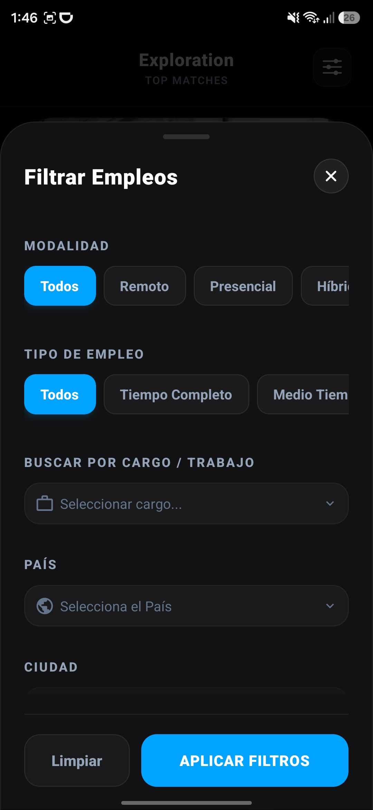
  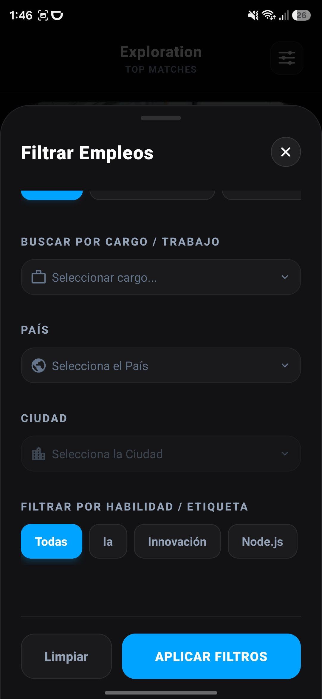

---

### 3.3. Bandeja "Postulaciones" e Historial
En la pestaña **Postulaciones**, se listan tus aplicaciones activas bajo un panel interactivo de tracking ordenado por las respuestas de los reclutadores corporativos.

> [!IMPORTANT]
> Las ofertas en estado "Recibida" (postulaciones que aún no han sido evaluadas por el reclutador) se mantienen discretas en tu panel general. Solo cuando la empresa otorga un "Match" de vuelta, se activa y se permite ingresar al panel de seguimiento detallado.

  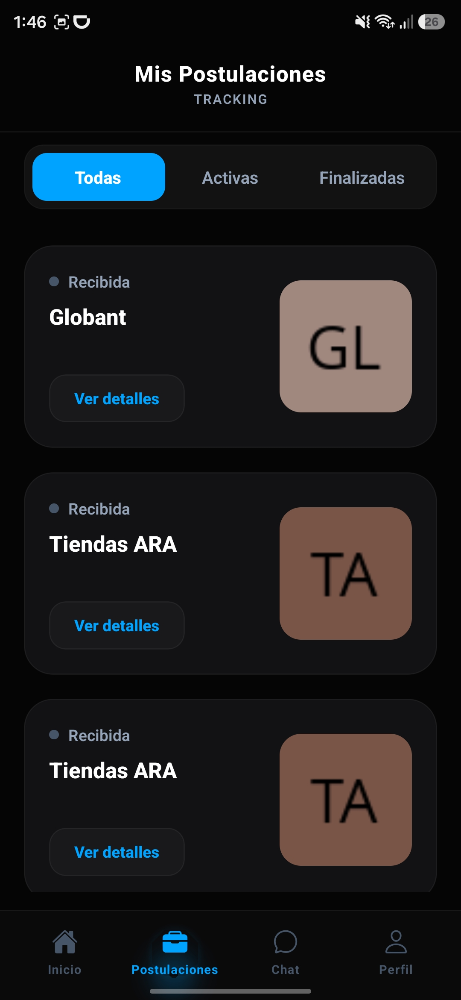

---

### 3.4. Detalle de Postulación y Seguimiento del Pipeline ATS (Cargar PDF)
Al ingresar en una vacante activa que ha tenido Match, se despliega un **Seguimiento del Proceso en Tiempo Real**:
- **Línea de tiempo interactiva:** Describe las etapas (ej. *Aplicación Enviada, En Revisión, Entrevistas, Decisión Final*).
- **Carga de Currículum en PDF:** Si el reclutador lo solicita, la línea de tiempo habilitará un botón interactivo para subir tu hoja de vida en PDF directamente desde el almacenamiento del móvil a Supabase Storage.
- **Sección FAQ (Preguntar a la Empresa):** Bloque interactivo para contactar de forma directa por mensajería al reclutador ante cualquier duda técnica.

  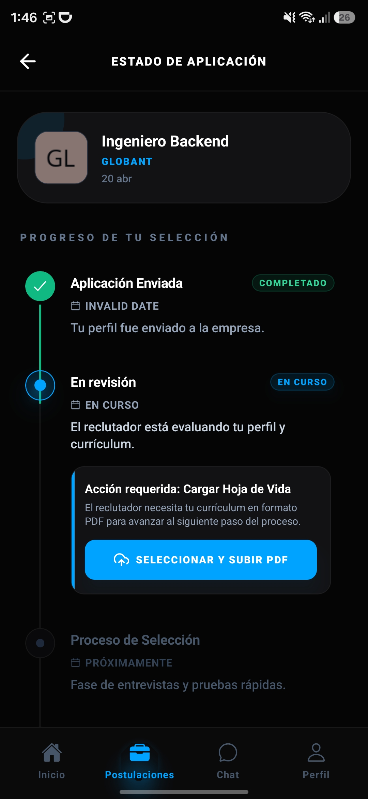
  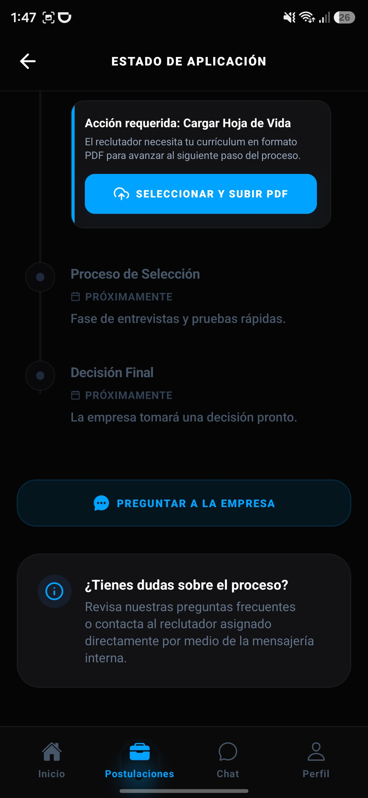

---

### 3.5. Hub del Perfil Profesional (Professional Hub)
En la pestaña **Perfil**, accedes a tu consola profesional global. Muestra tus estadísticas (ej. *8 postulaciones activas*), tu biografía y tus tarjetas dinámicas de información técnica, contacto y experiencias pasadas.

  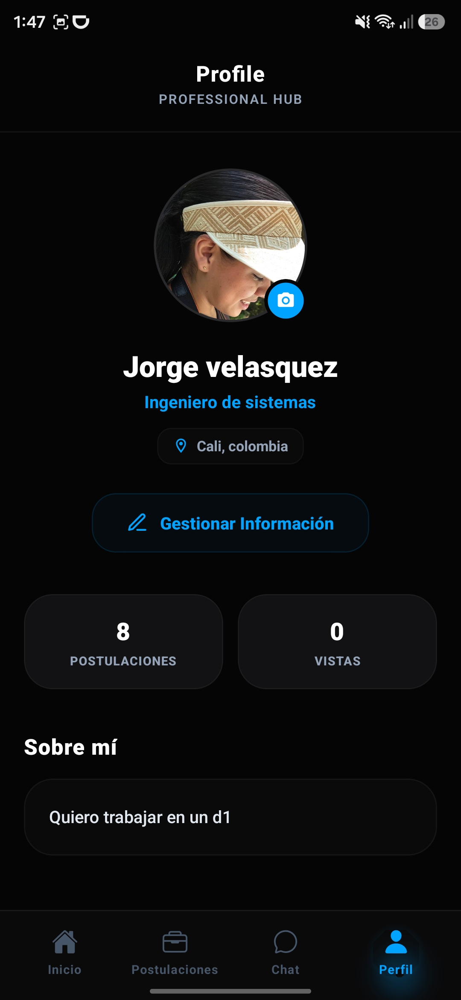
  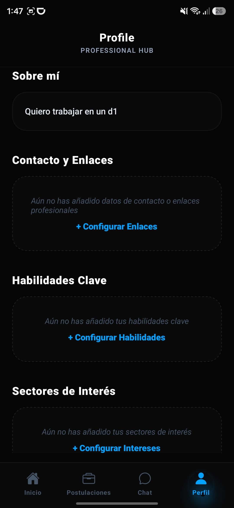
  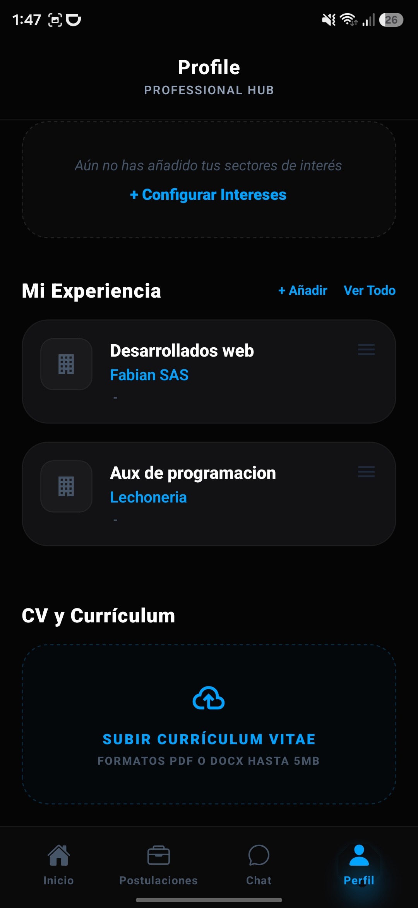

---

### 3.6. Gestión y Edición del Perfil
Al presionar "Gestionar Información", el candidato puede actualizar su currículum e intereses en un formulario estructurado de 5 secciones consecutivas:
1. **Información Personal:** Modifica el nombre completo, fecha de nacimiento y ubicación de residencia.
2. **Presencia Web:** Configura tus enlaces directos a redes como LinkedIn, GitHub o sitios portafolio además de tu teléfono celular.
3. **Perfil Profesional e Intereses:** (***Edición de Sectores del Candidato***) Permite reconfigurar el título profesional, tu rango técnico (Junior, Semi-Senior, Senior, Lead) y **los sectores de interés de la industria** (Tecnología, Finanzas, Comercio, Servicios, etc.).
4. **Habilidades / Etiquetas:** Adición y edición de habilidades blandas y técnicas separadas por comas.
5. **Resumen y Trayectoria:** Edición de tu biografía libre y adición/eliminación de puestos de trabajo anteriores.

  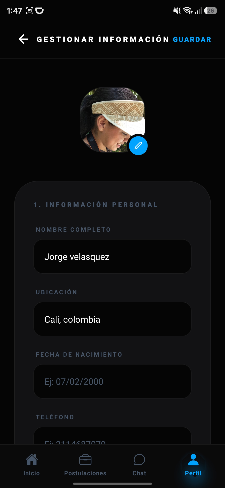
  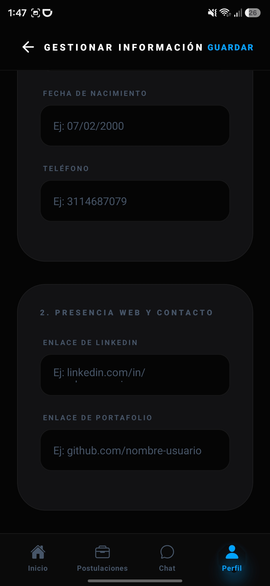
  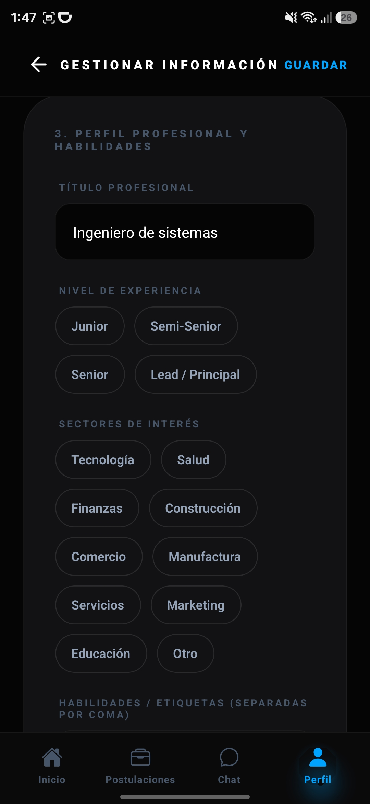
  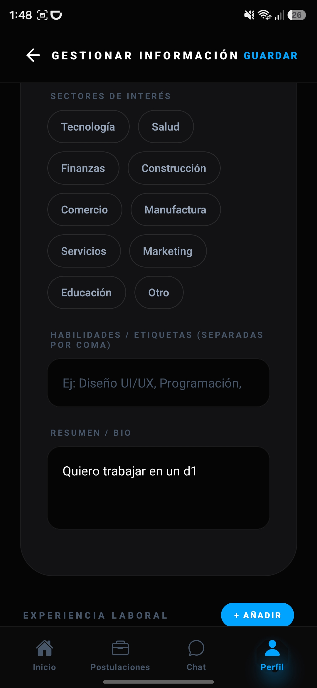
  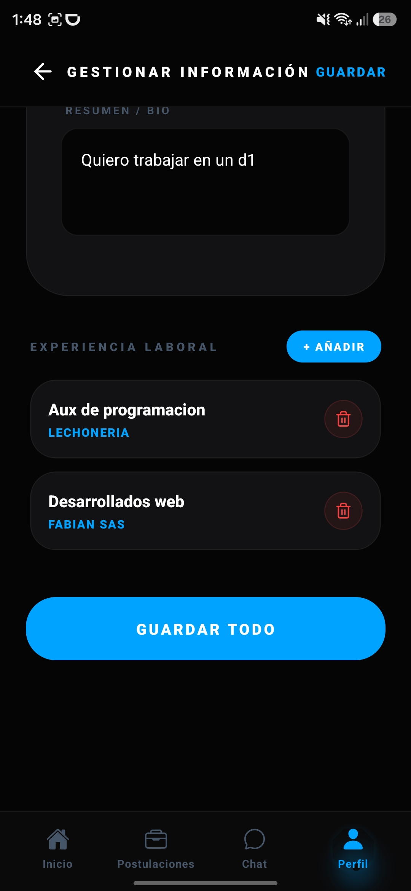

---

## 🏢 4. Consola ATS de Gestión de la Empresa

Las empresas tienen acceso a una suite de reclutamiento (ATS) potente para supervisar postulaciones, evaluar currículums y definir flujos interactivos.

### 4.1. Management Console (Bandeja de Ofertas y Aplicaciones)
Al iniciar sesión, la empresa ingresa a su panel de vacantes. Muestra todas sus ofertas publicadas en tiempo real (ej. *Líder de área TI en Cali*), con indicadores del presupuesto salarial y el conteo de aplicaciones activas que esperan revisión.

  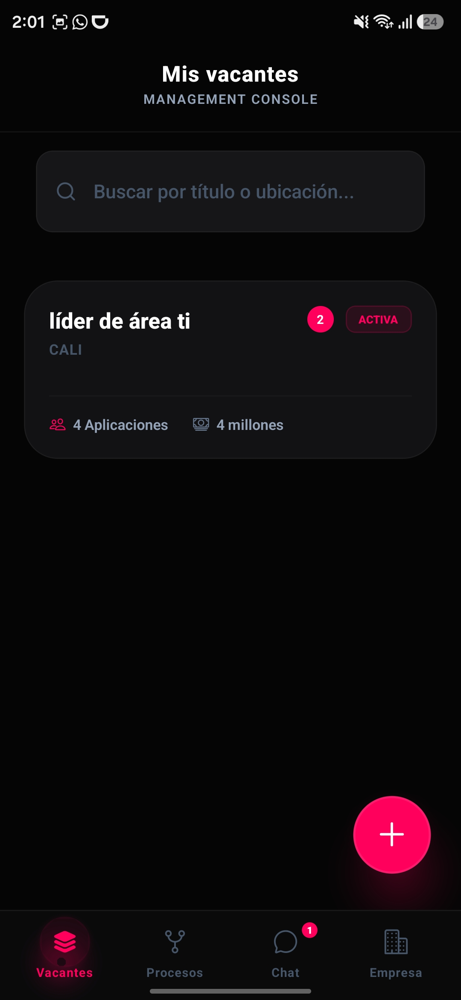

---

### 4.2. Publicar Nueva Oferta de Empleo
Crear una vacante requiere apenas unos clics mediante un formulario descriptivo dividido en dos paneles:
- **Detalles principales:** Título, ubicación de la plaza, rango de salario, modalidad (Híbrido, Remoto o Presencial), tipo de empleo (Tiempo completo, Medio tiempo, Práctica, Freelance) y descripción del cargo.
- **Requisitos y Habilidades:** Petición de años de experiencia, adición de tags de habilidades necesarias (ej. *Node.js*), beneficios adicionales (Seguro médico, gimnasio) y publicación directa.

  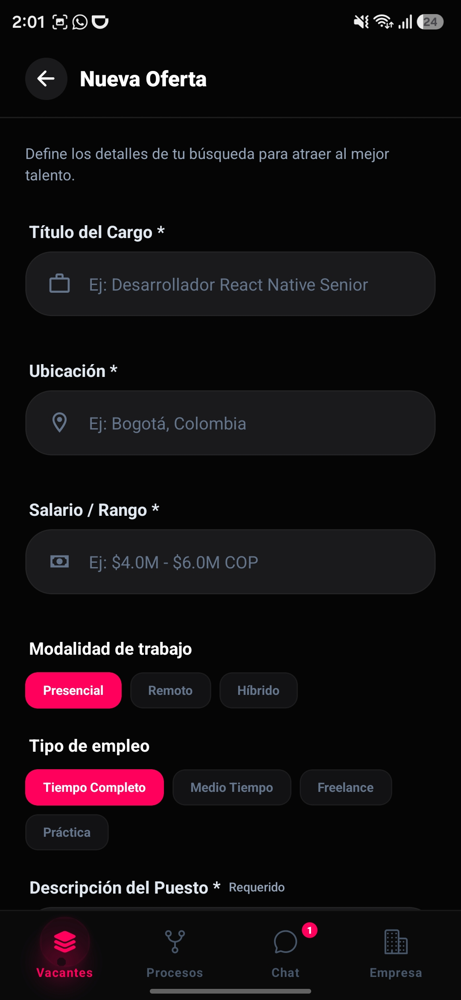
  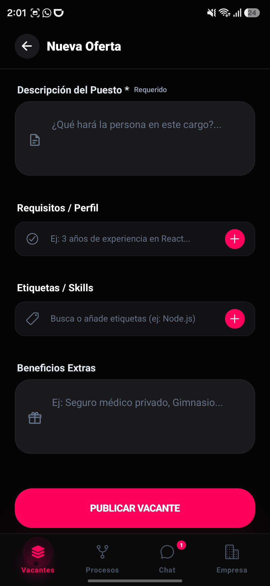

---

### 4.3. Swipe Recruiter Match Finder (Evaluación de Talentos con Match Score)
Al entrar al deck de candidatos de una vacante, el reclutador verá los perfiles postulados con una herramienta predictiva:
- **Match Score Predictivo:** Un porcentaje de compatibilidad (ej. **45% APTO**) calculado comparando las habilidades del perfil con los requisitos de la vacante, iluminando en rosa neón los tags en común.
- **Swipes corporativos:** Desliza a la derecha (o pulsa el pulgar hacia arriba) para preseleccionar e iniciar el chat en tiempo real; desliza a la izquierda (o pulsa la cruz) para descartar al candidato con seguridad.

  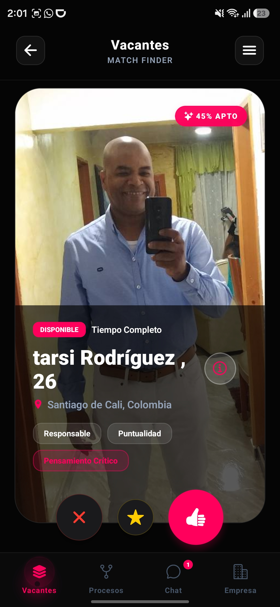

---

### 4.4. Detalles de la Oferta y Candidatos Aplicados
La empresa puede revisar en cualquier momento los parámetros de su oferta de empleo activa y ver la lista consolidada de los talentos que se han postulado (ej. *Fabián, Jorge, Fabian, Tarsi*).

  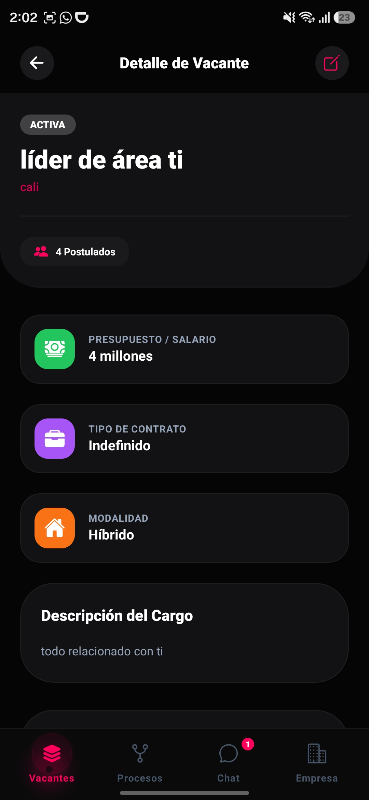
  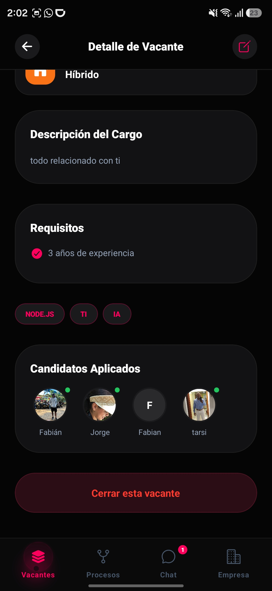

---

### 4.5. Panel Kanban de Procesos y Candidatos en Fases ATS
En la pestaña **Procesos**, la empresa puede monitorear de forma integral sus vacantes activas y ver qué candidatos se encuentran en cada etapa del embudo de contratación (ej. *Jorge Velasquez en etapa de Revisión* y *Fabián Andrés en etapa de Entrevista Inicial*).

  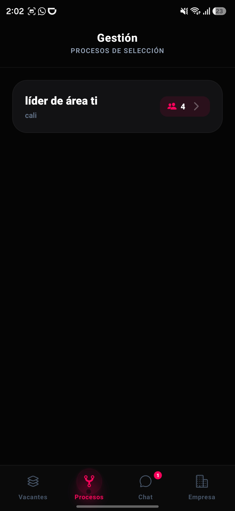
  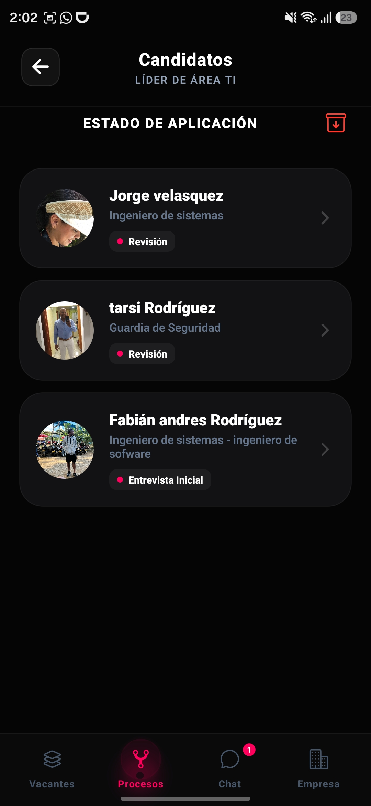

---

### 4.6. Guía de Contratación y Bitácora de Evaluación Individual
Al interactuar con la tarjeta de un candidato específico en el Kanban, la empresa entra a su ficha de seguimiento interactiva:
- **Acciones Rápidas:** Pulsadores para avanzar al candidato de fase instantáneamente (ej. *Entrevista Inicial, Selección Final, Solicitar Documentos, o abrir Chat*).
- **Bitácora de Evaluación Interna:** Cuadro de texto privado para que los reclutadores guarden observaciones del desempeño del candidato (visible únicamente por el equipo evaluador corporativo).
- **Acciones Críticas:** Opciones explícitas para **Descartar Candidato** o **Finalizar Proceso** exitosamente.

  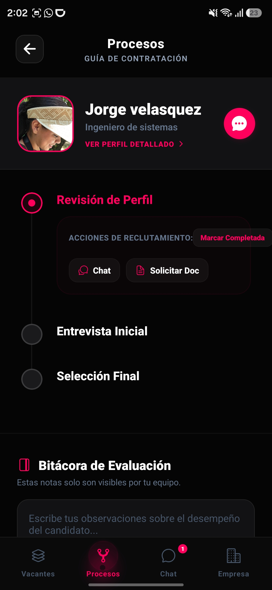
  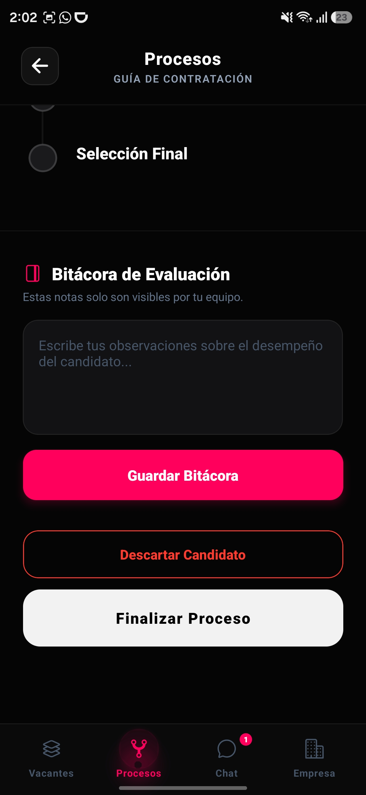

---

### 4.7. Visualización del Perfil de Candidato desde la Empresa
Al navegar por el proceso, la empresa puede revisar el perfil detallado del candidato, examinando su trayectoria laboral previa, su educación y verificando su estado actual dentro de la empresa (ej. *En Proceso - Entrevista Inicial*).

  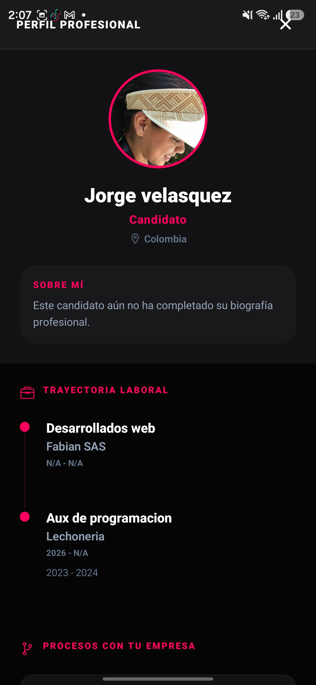
  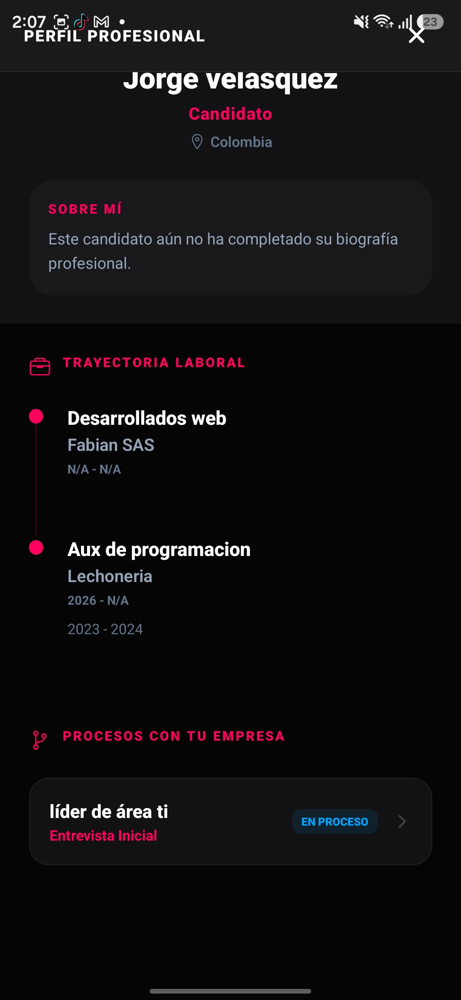

---

### 4.8. Hub Corporativo del Perfil Empresarial (Corporate Center)
En la pestaña **Perfil** de la empresa, se accede al **Corporate Center**. Esta consola expone las métricas de tu empresa (conteo de vacantes activas y candidatos postulados), tus datos de NIT, fundación y área, así como las etiquetas y misiones configuradas.

  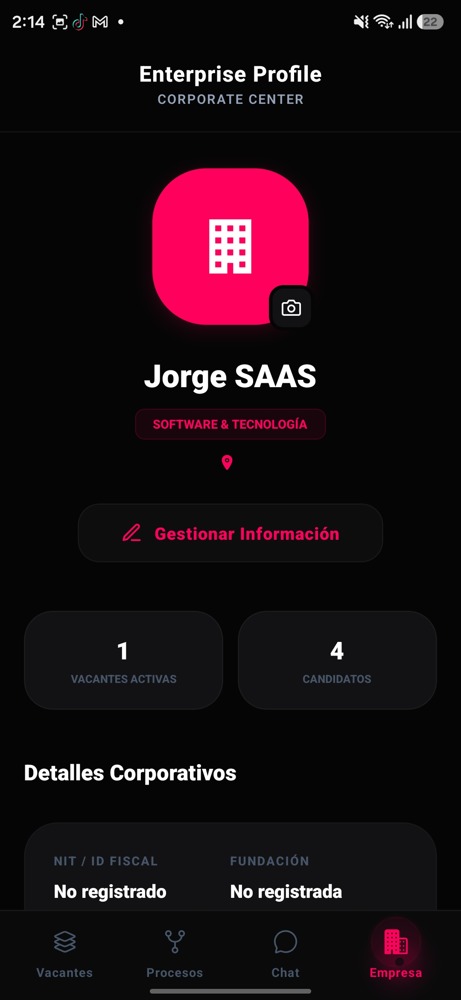
  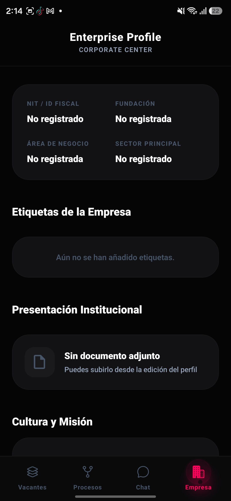
  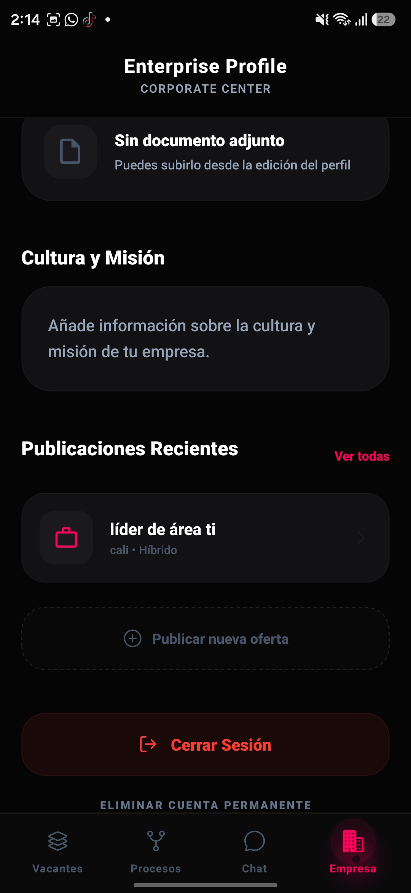

---

### 4.9. Gestión y Edición del Perfil de Empresa
Al presionar "Gestionar Información", el empleador accede al formulario de adición corporativa en 3 secciones consecutivas:
1. **Información General:** Nombre de la empresa, sitio web y ubicación de la sede principal.
2. **Identidad e Industria:** (***Edición de Sectores de Empresa***) Configuración de tu número de contacto, **NIT / ID Fiscal corporativo**, adición del **Sector / Industria principal** (ej. *Software, Construcción, Salud*) y tu **Área de Negocio** de operación (ej. *Desarrollo Web*).
3. **Cultura e Imagen:** Modificación de tus etiquetas, descripción detallada sobre la cultura y misión interna de la empresa, y carga del archivo PDF de presentación institucional para los candidatos.

  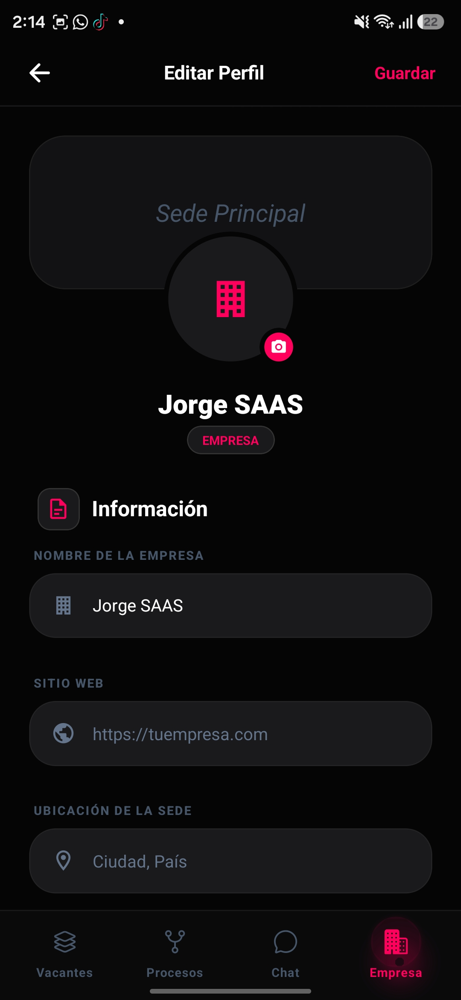
  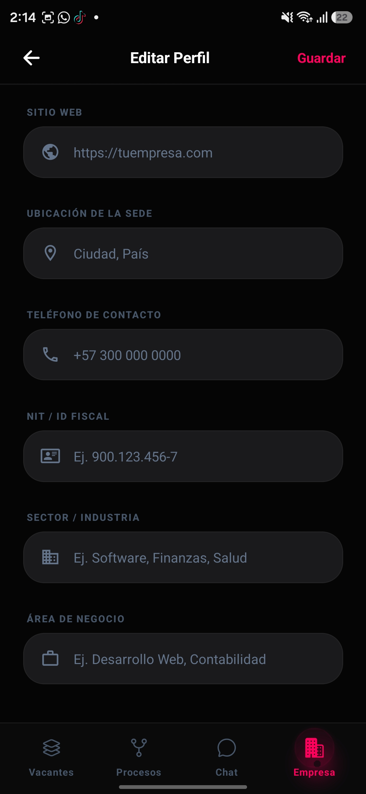
  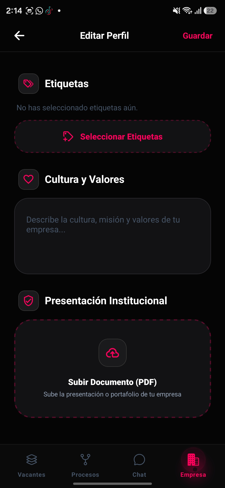

---

## 💬 5. Suite de Mensajería Global y Chat Enriquecido

La comunicación es instantánea en Aptly, utilizando los canales bidireccionales provistos por Supabase Realtime para que los mensajes e interacciones ocurran sin refrescar la pantalla.

### 5.1. Bandejas de Entrada de Mensajería (Candidato y Empresa)
Tanto los candidatos como las empresas poseen una pestaña **Chat** con una bandeja inmersiva ordenada cronológicamente por interacciones de mensajes, con soporte para barra de búsqueda de nombres y filtros rápidos de no leídos.

  
  
  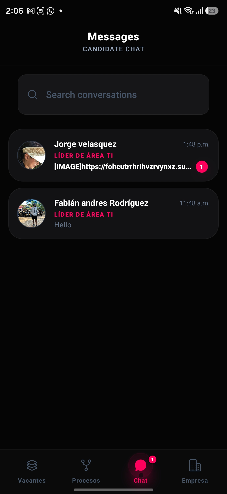

---

### 5.2. Chat en Tiempo Real y Soporte de Adjuntos
Las salas de chat disponen de un diseño premium oscuro idéntico para candidatos y empresas:
- **Mensajes enriquecidos:** Soporte para respuestas citadas (Reply deslizando a la derecha), envío de reacciones con emojis comunes y adición de fotos o currículums directamente desde tu cámara o archivos.
- **Navegación Intuitiva:** Toca la foto de perfil en el encabezado para ver el perfil público detallado y su progreso en el proceso sin perder tu sesión de chat.

  
  

---

## 🔔 6. Sistema de Alertas Realtime (Badge Campanita 🔔)

Aptly cuenta con una bandeja de notificaciones push y alertas en tiempo real integrada en el encabezado global global (**Obsidian Header**).

En la esquina superior izquierda de las pantallas del candidato, podrás observar un **Badge numérico de color rosa** (ej. **`26`**) justo encima del icono de la campanita 🔔:
- **Alertas del Candidato:** Indica el conteo de notificaciones sin leer (mensajes nuevos, invitaciones a entrevistas tras un Match, confirmaciones de procesos y retroalimentaciones).
- **Alertas de Empresa:** Notificaciones instantáneas sobre nuevos candidatos interesados en sus ofertas, subidas de CV en PDF de candidatos en proceso, y respuestas en chats.
- Al pulsar el icono de la campanita 🔔, se despliega un panel glassmórfico de lectura rápida que permite marcar todas tus notificaciones como leídas con un solo clic.

  
  

---

## 🎯 ¡Eso es todo!

¡Has completado el manual de usuario! Con esta guía exhaustiva estás completamente listo para dominar cada rincón de **Aptly**, tanto si eres un profesional buscando destacar en tus habilidades certificadas por IA, como si eres una empresa diseñando un embudo ágil de selección de personal. ¡Disfruta la experiencia premium de reclutamiento digital!
